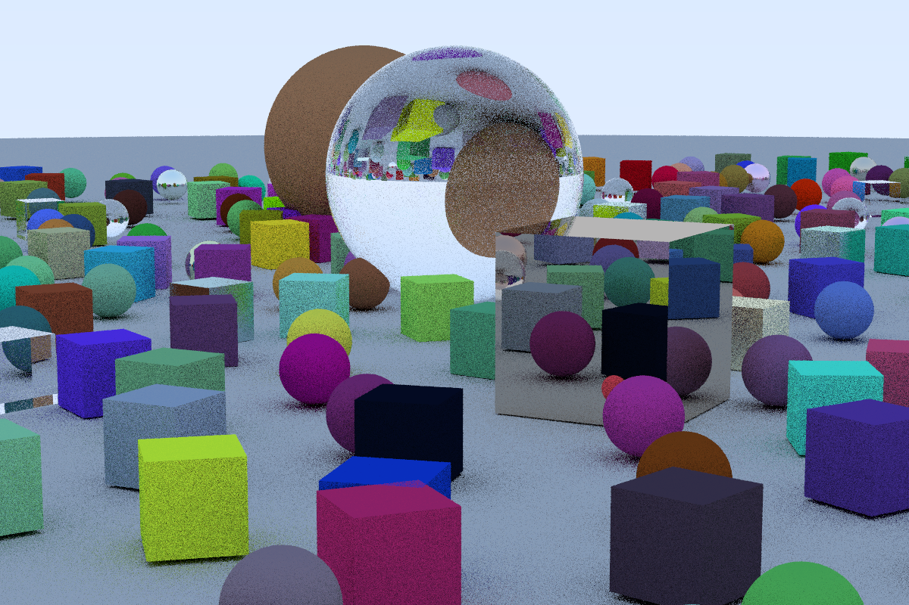

# raytracing

Simple ray tracing implementation on Rust from  _''Ray Tracing in One Weekend''_ repository. Cubic objects available.

# Bibliography

[Raytracing in One Weekend - C++](https://raytracing.github.io/books/RayTracingInOneWeekend.html)
[Radiative View Factors](http://webserver.dmt.upm.es/~isidoro/tc3/Radiation%20View%20factors.pdf)